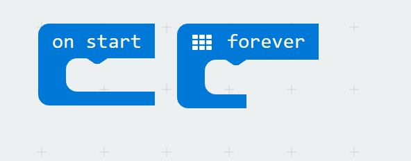
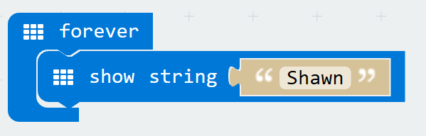
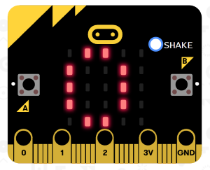
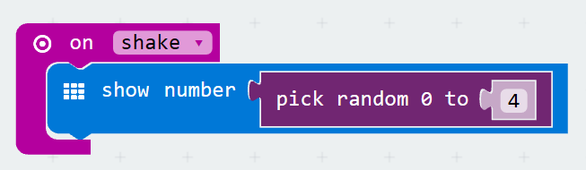
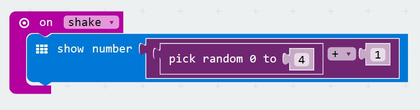
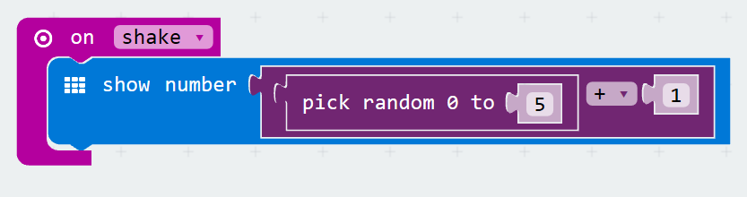

# micro:bit Software Overview
[Home](./)

## Power up your micro:bit for the first time

1. Plug in the USB cable to your PC and then into the top of your micro:bit.
1. The screen on your BBC micro:bit will slowly wake up with light patterns, and will then introduce itself. 
1. Follow the instructions and press the buttons as it asks. You will know you’ve done it right because the lights will display patterns.

## Tour of Microsoft MakeCode

We will be using the MakeCode code editor from Microsoft. 

* **Simulator**	 - on the left side of the screen, you will see a virtual micro:bit that will show what your program will look like running on a micro:bit. This is helpful for debugging, and instant feedback on program execution.
* **Toolbox** - in the middle of the screen, there are a number of different categories, each containing a number of blocks that can be dragged into the programming workspace on the right. 
* **Workspace** - on the right side of the screen is the Programming Workspace where you will create your program.  Programs are constructed by snapping blocks together in this area.

The color of the blocks identifies their category. All of the blocks that make up the program above come from the **Basic** Toolbox category, which is light blue.

## Downloading a MakeCode program to the micro:bit

To download the file to your micro:bit, you must connect it to your computer’s USB port using a micro-USB cable. The micro:bit will draw power from your computer through the USB connection, or you can connect an optional battery pack so it can function even after it is unplugged from the computer. Once plugged in, the micro:bit shows up on your computer like a USB flash drive.

Click the purple Download button in the lower left of the MakeCode screen. This will download the file to your computer, to the location where your browser is set to save downloads.

To move the program to your micro:bit, drag the downloaded "microbit-xxxx.hex" file to the MICROBIT drive, as if you were copying a file to a flash drive. The program will copy over, and it will begin running on the micro:bit immediately.

The micro:bit will hold one program at a time. It is not necessary to delete files off the micro:bit before you copy another onto the micro:bit; a new file will just replace the old one.

## MAKE: Digital name tag

The digital name tag will scroll our name accross the display, forever.

1. Start by going to [https://makecode.microbit.org/](https://makecode.microbit.org/). 

    > Tip: If you right click on the link above and open it in a "new window", you can use the alt + tab keyboard shortcut to flip between these instructions and your code editor.

1. Your code editor should default to having two events, `on start` and `forever`. It will look like this:

    

1. In the Basic toolbox category you will find a block to `show string`. Drag and drop it into the `forever` event, and change "Hello!" to your name. It should look like this (with your name not mine):

    

1. You should now see your program running in the simulator, is everything working correctly? 
1. If so lets download out program to our micro:bit, ensure that your micro:bit is still be connected to your computer via the USB cable. 
1. Give your project a name and press save, and then Save As the .hex file to your micro:bit. 
1. After it downloads and reboots, you should see your name on the micro:bit LEDs.

## MAKE: Digital Die

When the micro:bit is shaken, the digital die, will display a random number from 1 to 6 simulating a 6 sided die.

1. Select Projects and then New Project to reset our code editor.
1. Drag an `on shake` event from the input toolbox onto our designer. 
1. Drag a `show number` block from the basic toolbox onto our designer. Our program should look like this:

    

1. We can now test it in our simulator. Obvously we don't want to pickup our computer and shake it, so they have added a 'shake button' to simulate shaking the micro:bit. Press the button and see what happens.

    

1. Great now we are displaying a "0" whenver the micro:bit is shaken, lets alter our program to replace that "0" with a random number. In the math toolbox section, you will find a `pick random 0 to X` block. Drag it onto the designer replacing the `0` we currently have in our `show a number` block. Your program should look something like this, test it in the simulator again. 

    

1. Awesome, if you "shake" your micro:bit enough times you will see that we sometimes will "roll" a zero. However, we want to ensure that our users can roll from a 1 to a 6. Since our random number generator always starts at a zero, if we take the random number it gives us and add one, we can ensure the minimum roll is a 1. In the math toolbox, drag an addition block onto the designer. Place our random block in the first position and ensure it says "+" in the middle, and then one on the right. We can now put the entire composit block into our `show number` command, like so, and then test it in the simulator.

    

1. Great, but we still have a bit of an issue. The max random number we will generate currently is 4 if we add one we get 5, so we only have a 5 sided die, we need a traditional 6 sided die. So lets change our random number generator to generate a random number between 0 and 5, and test it on the simulator again. 

    

1. Now, that our program is working, lets give it a name and save & download it to our micro:bit.

    > NOTE: be **very careful** shaking your micro:bit as it is still connected to your computer. 