# Happy Face, Sad Face
[Home](./)

The micro:bit itself is considered hardware.  It is a physical piece of technology.  In order to make use of hardware, we need to write software (otherwise known as "code" or computer programs). The software "tells" the hardware what to do, and in what order to do it using algorithms.  Algorithms are sets of computer instructions.

In this activity, we will discover how to use the micro:bit buttons as input devices, and write code that will make something happen on the screen as output. We will also learn about pseudocode, the MakeCode tool, event handlers, and commenting code.

## Pseudocode
What do you want your program to do?

The first step in writing a computer program is to create a plan for what you want your program to do. Write out a detailed step-by-step plan for your program. Your plan should include what type of information your program will receive, how this input will be processed, what output your program will create and how the output will be recorded or presented. Your writing does not need to be written in complete sentences, nor include actual code. This kind of detailed writing is known as pseudocode. Pseudocode is like a detailed outline or rough draft of your program. Pseudocode is a mix of natural language and code.

For the program we will write, the pseudocode might look like this:
* Start with a blank screen
* Whenever the user presses button A, display a happy face.
* Whenever the user presses button B, display a sad face.
	
## Event handlers
When you start a new project, there will be two blue blocks, ‘on start’ and ‘forever’ already in the coding workspace. These two blocks are event handlers.

In programming, an event is an action done by the user, such as pressing a key or clicking a mouse button.  An event handler is a routine that responds to an event.  A programmer can write code telling the computer what to do when an event occurs.

### Getting Help in Microsoft MakeCode

* Tooltips - Hover over any block until a hand icon appears and a small text box will pop up telling you what that block does. You can try this now with the ‘on start’ and ‘forever’ blocks. Notice that it also shows you the equivalent code in JavaScript. 
	
    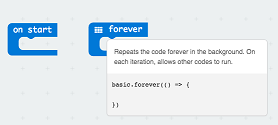

* Help/Documentation - You can also right-click on any block and select Help to open the reference documentation.

    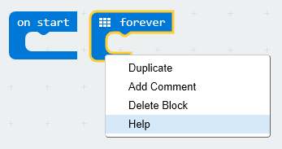

* Deleting blocks - Click on the 'forever' block and drag it left to the Toolbox area. You should see a garbage can icon appear. Let go of the block and it should disappear. You can drag any block back to the Toolbox area to delete it from the coding workspace.  You can also remove a block from your coding window by selecting the block and then pressing the "delete" key on your keyboard (or command-X on a mac).

    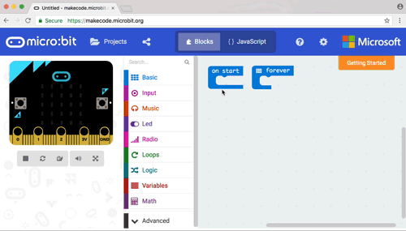

Looking at our pseudocode, we want to make sure to start a program with a clear screen.

* We can do this by going to the Basic menu -> More and choosing a ‘clear screen’ block.

    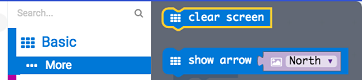

* Drag the ‘clear screen’ block to the coding Workspace.

    > Notice that the block is ‘grayed’ out. If you hover over the ‘grayed out’ block, a pop up text box will appear letting you know that since this block is not attached to an event handler block, it will not run.

    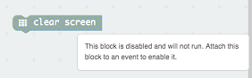

* Go ahead and drag the ‘clear screen’ block into the ‘on start’ block. Now the block is no longer grayed out, indicating that it will run when the event, the program starts, occurs.

    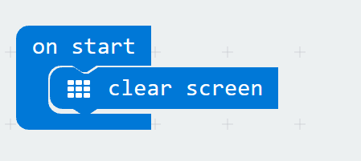

## Save early, save often!

We now have a working program running on the micro:bit simulator! 
As you write your program, MakeCode will automatically compile and run your code on the simulator. The program doesn’t do much at this point, but before we make it more interesting, we should name our program and save it.

On the bottom left of the application window, to the right of the Download button, is a text box in which you can name your program. After naming your program, press the save button to save it.

>Important: Whenever you write a significant piece of code or just every few minutes, you should save your code. Giving your code a meaningful name will help you find it faster from a list of programs and will let others know what your program does.

>Note: Programs saved in the browser window will go away if the browser is reset. To keep your programs forever, download the .hex files, to your computer. You can then upload the .hex files later to edit your program or copy them to your micro:bit.

## More event handlers
Now to make our program a bit more interesting by adding two more event handlers.

* From the Input menu, drag two ‘on button A pressed’ blocks to the coding window.

    >Notice that the second block is grayed out. This is because, right now, they are the same block, both ‘listening’ for the same event ‘on button A pressed’.

    

* Leave the first block alone for now, and using the drop-down menu within the second block, change the ‘A’ to ‘B’. Now this block will no longer be grayed out, as it is now listening for a different event, ‘on button B pressed’.

    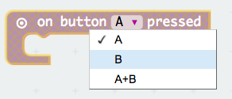

* Your program should now look like this.

    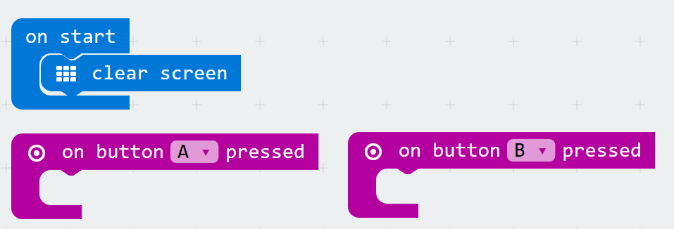

## Show LEDs
Now we can use our LED lights to display different images depending on what button the user presses.
* From the Basic menu, drag two ‘show leds’ blocks to the coding workspace
* Place one ‘show leds’ block into the ‘on button A pressed’ event handler and the second ‘show leds’ block into the ‘on button B pressed’ event handler.
* Click on the individual little boxes in the ‘show leds’ block that is in the ‘on button A pressed’ event handler to create the image of a happy face.
* Click on the individual little boxes in the ‘show leds’ block that is in the ‘on button B pressed’ event handler to create the image of a sad face.

    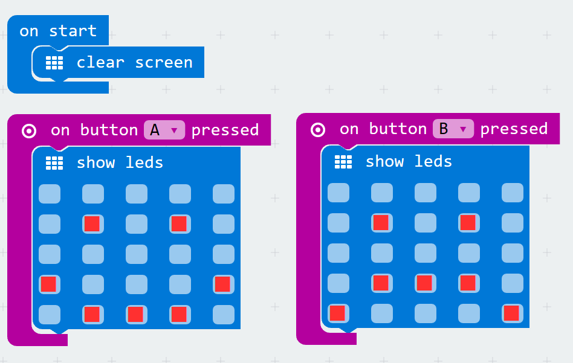

## Test your program!
Remember, MakeCode automatically compiles and runs your program, so all you need to do now is press button A and then button B in the simulator to see the output produced by your code. 

* Feel free to play around with turning LEDs on or off in the ‘show leds’ blocks until you get the images you want. 
* Remember to save your code. 

## Commenting your code
It is good practice to add comments to your code. Comments can be useful in a number of ways. Comments can help you remember what a certain block of code does and/or why you chose to program something the way you did. Comments also help others reading your code to understand these same things.

To comment a block of code:

* Right-click on the icon that appears before the words on a block.
* A menu will pop up. Select ‘Add Comment’.
	
    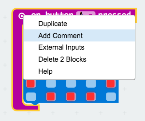

* This will cause a question mark icon to appear to the left of the previous icon.
* Click on the question mark and a small yellow box will appear into which you can write your comment.
	
    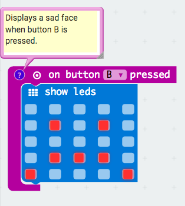

* Click on the question mark icon again to close the comment box when you are done.
* Click on the question mark icon whenever you want to see your comment again or to edit it.
	
> Note: When you right-click on the icon that appears before the words on a block, notice that there are other options available to you that allow you to duplicate and delete blocks, as well as get help. Feel free to explore and use these as you code.

## Cleaning up!

Clean up your coding workspace before you do a final save! What does this mean?

* It means that only the code and blocks that you are using in your program are still in the workspace.  
* Remove (delete) any other blocks that you may have dragged into the coding workspace as you were experimenting and building your program.
	
## Save and download
Now that your code is running just fine in the simulator, is commented, and your coding window is ‘clean’, save your program, download it to your micro:bit, and enjoy!
