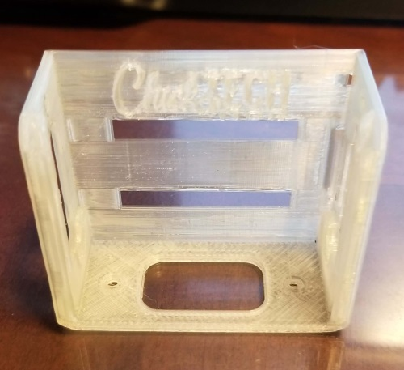

# Using our 3d printer to make a watch frame
[Home](./)

## What is 3d printing?

<iframe width="560" height="315" src="https://www.youtube.com/embed/3LBTkLsjHGQ" frameborder="0" allowfullscreen></iframe>

[MyMiniFactory](https://www.myminifactory.com/object/3d-print-micro-bit-watch-frame-with-battery-compartment-79577)

## Demo: Our watch frame

1. 3d CAD Model
1. .STL File
1. Slicing Software
1. Printing
    1. Printer Parts
    1. Preparing the print bed
    1. Go