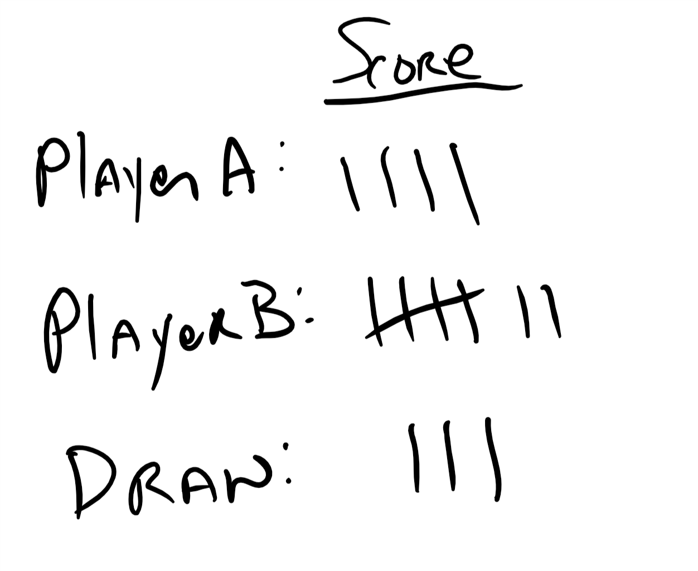

# Scorekeeper Challenge
[Home](./)

## Your Challenge

Competitive Tic Tac Toe has been sweeping the nation. Each game ends in either Player A winning, Player B winning or a Draw. However the players are having trouble keeping score. Your mission is to build an application to run on your micro:bit that will keep score, to replace the paper scoring system pictured below. 

The specifications are as follows:

1. When player A wins a game they will press the A button adding 1 point to player A's overall score and display a graphic showing that player A got a point.
1. When player B wins a game they will press the B button adding 1 point to player B's overall score and display a graphic showing that player B got a point. 
1. If the game ends in a draw the players press the A + B buttons together adding 1 point to the draw score and display a graphic showing that draws got a point.
1. When the micro:bit is shaken it will display the score for all three values (player A, player b & draw).

Don't forget that you should:
1. Start by writing pseudocode to plan out what your program should do.
1. Comment your code, so that others can read the code and understand what it does. 
1. Test your code first in the simulator and then on the physical device.
1. Use/extend code that you have written in the past for ideas & inspiration.
