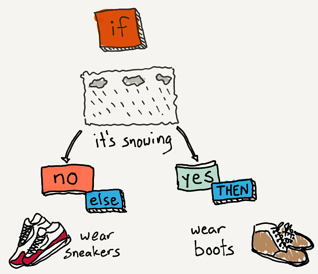

# Conditional statements: Overview
[Home](./)

Computer programs are instructions telling the computer how to process input and deliver output. An important part of programming is telling the computer WHEN to perform a certain task. For this, we use something called ‘conditionals’. Conditionals get their name because a certain Condition or Rule has to be met.

Your are likely already familiar with the concept of conditionals in your daily life!

Have you ever heard someone say..?
* “If you clean your room, you can go out with your friends.”
* “If your homework is done, you can play video games.”
* “If you do your chores all week, you get your allowance, else you are grounded.”

These are all conditionals! Conditionals follow the format of IF this, THEN that.
> **IF** (condition is met)  
    **THEN** (action performed)

Conditionals can also have a default action if the condition is **NOT** met, we call this the **ELSE**
> **IF** (condition is met)  
    **THEN** (action performed)  
    **ELSE** (different action performed)

Example:
* IF it is snowing, THEN wear boots, ELSE wear shoes.

The ELSE portion makes sure that a different action is performed in either case. Without the ELSE action, you might be barefoot! 

## Activity:
Can you come up with a few conditionals from your own life?

