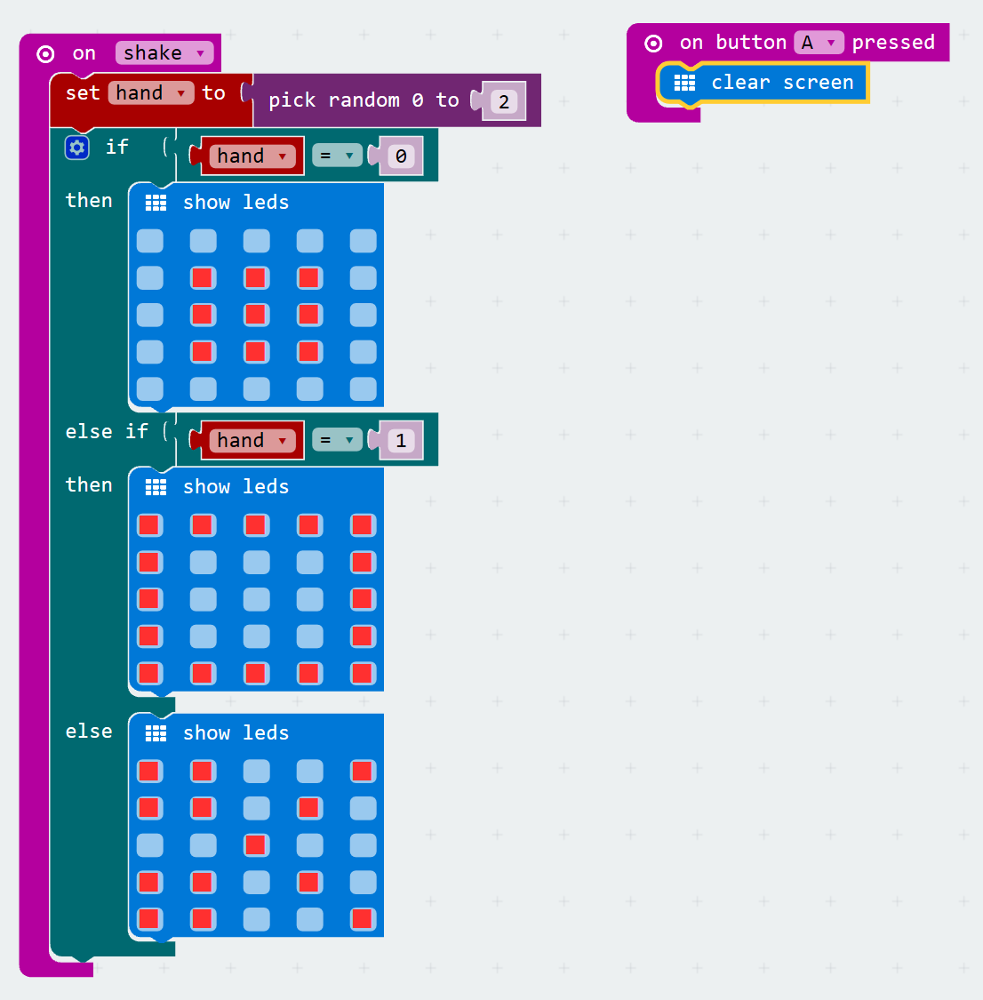

# Rock, paper, scissors
[Home](./)

<iframe width="560" height="315" src="https://www.youtube.com/embed/z5IIHzmzzHM" frameborder="0" allowfullscreen></iframe>

## Pseudocode

1. On Shake a random number will be selected between 0, 1 and 2
1. If it is a 0 then display rock
1. If it is a 1 then display paper
1. If it is a 2 then display scissors
1. If the A button is press, clear the screen for the next match

## Step by Step

1. Create a new code project if you haven't done so already.
1. Lets start by adding `on shake` block to your code.
1. Next lets create a variable called 'hand'. This will hold a number 0, 1 or 2, where a 0 is a rock, a 1 is paper, and a 3 is scissors. 
1. In our `on shake` block we need to set the value of hand to our random number (0, 1, or 2) using the `pick random` math block.
1. Next, we will add an if conditional statment that checks the value of the hand variable.
1. If hand = 0 then we will display a rock using the LEDs.
1. Else If hand = 1 then we will display a paper using the LEDs.
1. Else is not one of the above (i.e. it is 2) then we will display scissors using the LEDs.
1. Add an `on button A pressed` event, and place the `clear screen` basic block in it. 

When complete your code should look like this:

