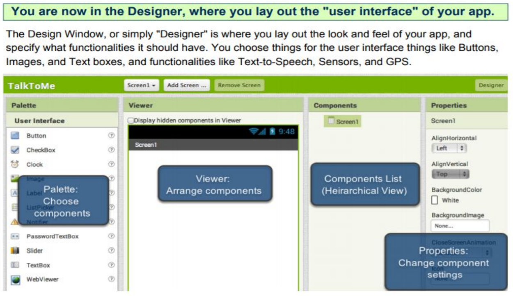
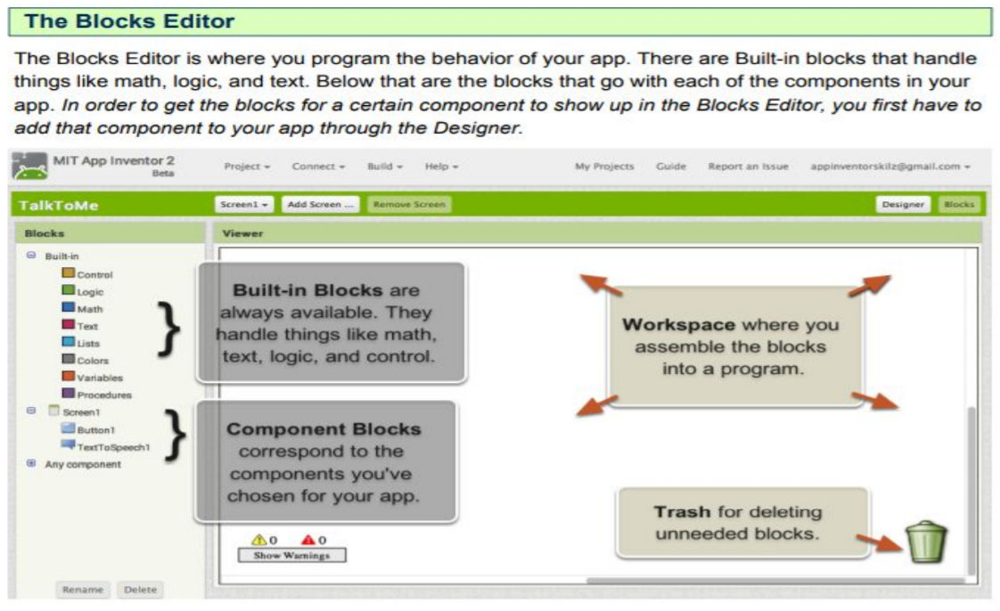

# Introduction to App Inventor

App Inventor is a block-based programming environment that allows us to make mobile apps for tablets and smartphones. 

<iframe width="560" height="315" src="https://www.youtube.com/embed/sNjGAiOrX-o" frameborder="0" allow="accelerometer; autoplay; encrypted-media; gyroscope; picture-in-picture" allowfullscreen></iframe>

## App Inventor Programming Environment

## Test your first app

1. Download the Two Button Game [here](./ctct/Unit01-HelloItsMe/TwoButtonGame.aia)
1. Follow the instruction worksheet [here](./ctct/Unit01-HelloItsMe/GameStudentGuide.pdf)

[Home](./index.md)