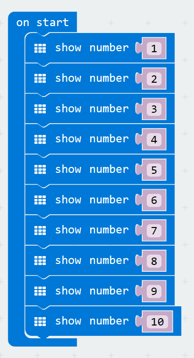
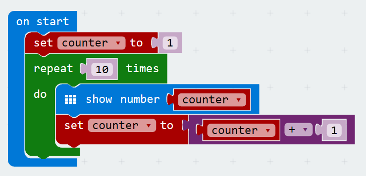
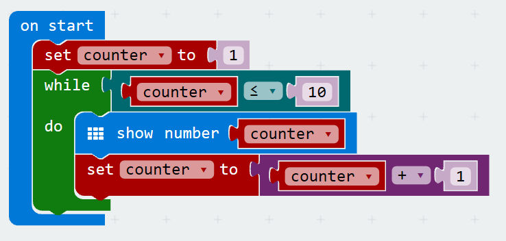
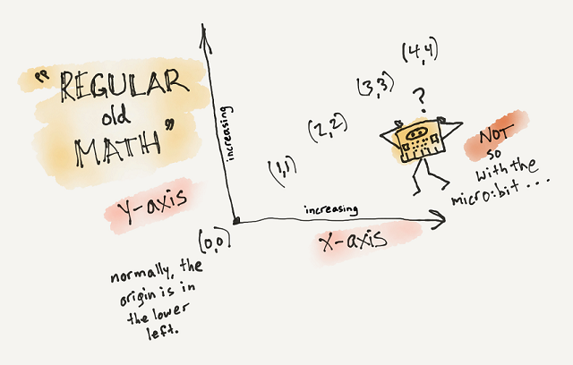

# Iteration, Looping & Coordinates
[Home](./)

## Iteration & Looping
What if I wanted to write a program that would display the numbers 1 to 10 on my micro:bit?

I could write something like this:

What is wrong with this?
1. Lots to write
1. Hard to maintain
1. Hard to extend (What if we now needed to count to 15?)

What if we could rewrite the above code in 2 lines?

This is a `for loop`. It uses a variable, index, to keep track of what iteration it is on, and provides a start value, 0, and an end value, 9.

> Note: since the for loop starts at 0 and we want our printed list of numbers to start at one, we add one inside of the loop before we print the number out. 

Our block programming language also provides a `repeat loop`. Using a repeat loop we can achieve the same mission. Since I need to know what iteration I am on for this task (i.e. printing out 1 - 10), with the repeat loop I had to create a variable to hold this state.

In addition to the `for loop` and the `repeat loop` our block programming language offers us a thrid type of loop, the `while loop`. The `while loop` works with the same conditional that we used with our if/else conditions. When the condition is false then it stops looping. Here is an example of our same counting algorithm wrtten as a `while loop`.

## Coordinates

Through math class, you are probably already familiar with coordinate grids and mapping x and y coordinates on a plane. To review some terms:

### Axes
* The basic coordinate grid a student learns has two axes,

>* an x-axis which runs horizontally and 
* a y-axis which runs vertically.
	
### Origin
* These two axes meet at a point called the origin where both the x and the y values are zero.
* On this basic coordinate grid, the origin is in the lower left corner of the grid and has the coordinates (0,0).
	
### Coordinate pair
* The first value in a coordinate pair is the x value and the second value in a coordinate pair is the y value.
* A simple way to remember which value comes first is to remember their order in the alphabet. The letter x comes before the letter y in the alphabet and the x coordinate comes before the y coordinate in a coordinate pair.
	
### Coordinate value changes
* On a basic coordinate grid,
    * the value of the x coordinate increases left to right and is a measure of how many units a point is horizontally from the origin
    * the value of the y coordinate increases bottom to top and is a measure of how many units a point is vertically from the origin
	
    

### Coordinate grid for the micro:bit

The 5 x 5 grid of LEDs on the micro:bit represent a coordinate grid with a horizontal x-axis and a vertical y-axis. It has an origin and you can refer to the position of the LEDs with coordinate pairs.  

It is important to note the two major differences between the micro:bit LED grid and the coordinate grid that from math class:
* the origin (0,0) is in the top left corner.
* the values of the y coordinates range from 0 through four and increase from top to bottom.
	
Note:
* The values of the x coordinates range from 0 through four and increase from left to right just as they do in the coordinate grids used in math class.

