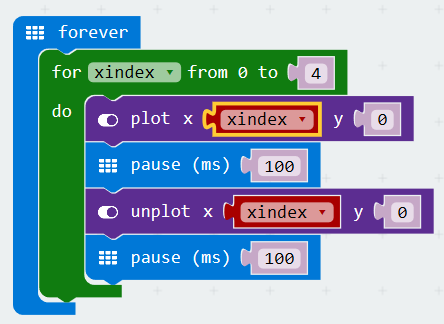

# Traveling light
[Home](./)

## Objective
The goal is to make the LEDs accross the top row of the micro:bit light up one by one, starting on the left and going to the right, and once we get to the right most LED, start over on the left, forever. 

## Step by Step
1. Start with a new project
1. Lets start by creating an `xindex` variable
1. Now lets add a `for loop` to our `forever` event brick. Configure it to use the xindex variable and leave the to set to '4'
1. Now lets illuminate the first LED using the `plot` command from the LED toolbox category. Lets add it inside our for loop and set the x coordinate to our xindex variable.
1. Now lets use the `pause` brick to leave the light on for 100 ms.
1. Now lets turn off the LED using the `unplot` brick, dont forget to set the x coordinate like we did a moment ago.
1. Now lets use the `pause` brick to leave the light on for 100 ms.

That is it our code should look like this and should be doing what we want. 

