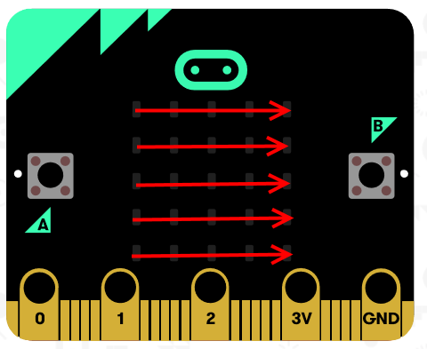
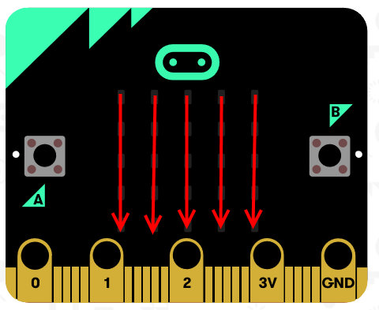

# Traveling Light Challenge
[Home](./)

## Objective
Enhance our program from the last step, to make the light travel not only accross the LEDs on the x axis but also the y axis. 

### Phase 1
Start by lighting the LED in each column, before moving down to the next row. 

> HINT: you can nest one loop inside another.

### Phase 2
Can you alter your code so it goes down each row, before moving over to the next row.

