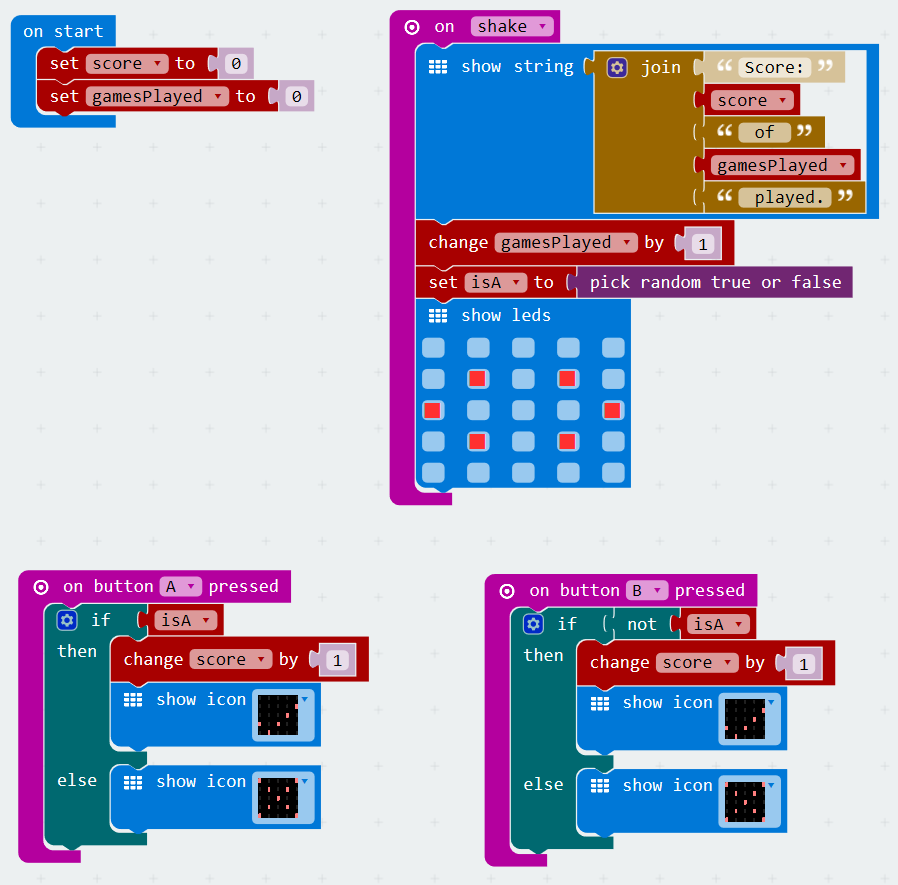

# Pick a Hand Game
[Home](./)

<iframe width="560" height="315" src="https://www.youtube.com/embed/rlyuWnYuZiw" frameborder="0" allowfullscreen></iframe>

## Objective
Lets build a simple "pick a hand game". When the micro:bit is shaken the game will display the current score and select either the A button or B button as the correct answer. The game must be able to keep count of the total games played and the current score. 

## Pseudocode
* on start
    * initialize variables
        * score - integer - to 0 - holds the current score
        * gamesPlayed - integer - to 0 - holds the count of the games played
* on shake
    * Show score "Score: [score] of [gamesPlayed] played."
    * increment geamesPlayed by 1
    * set isA to random true/false
    * show icon to tell user to pick
* on button A pressed
    * if isA then add a point show check
    * else show X
* on button B pressed
    * same as button A except it shoud be NOT isA

## The Code

