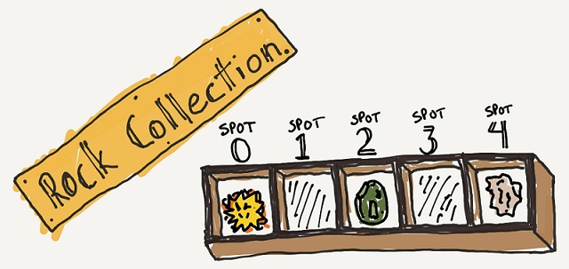
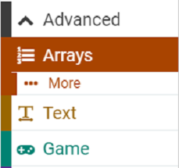
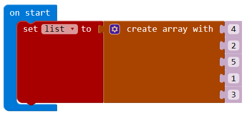
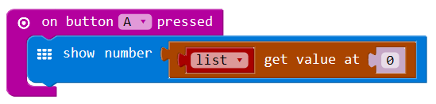

# Arrays Overview
[Home](./)

Any collector of coins, fossils, or baseball cards knows that at some point you need to have a way to organize everything so you can find things.  For example, a rock collector might have a tray of specimens numbered like this:

Every rock in the collection needs its own storage space, and a unique address so you can find it later.

As your programs get more and more complicated, and require more variables to keep track of things, you will want to find a way to store and organize all of your data.  Programming languages provide a special datatype for just this purpose, called an Array.
 
* Arrays can store numbers, strings (words), or sprites. They can also store musical notes. 
* Every spot in an array can be identified by its index, which is a number that corresponds to its location in the array. The first slot in an array is index 0, just like our rock collection above. 
* The length of an array refers to the total number of items in the array, and the index of the last element in an array is always one less than its length (because the array numbering starts at zero.)
 
In MakeCode, you can create an array by assigning it to a variable.  The Array blocks can be found under the Advanced Toolbox menu.

The code above creates an empty array called list, then fills it with five numbers, indexed from 0 to 4. The index of the first value (4) is 0. The index of the second value (2) is 1. The index of the last value (3) is 4. 
 
You can get items out of the array by specifying its index like this:

The code above takes the first element in the array (the value at index 0) and shows it on the screen.
