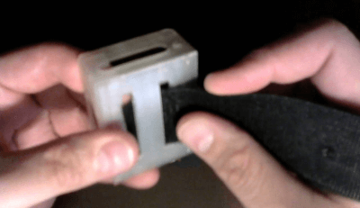
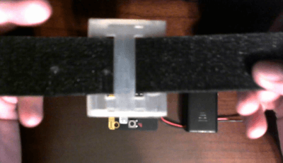
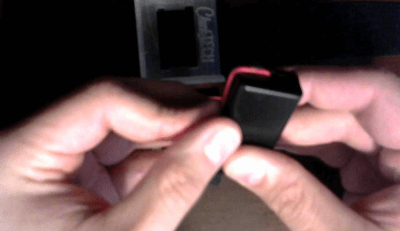
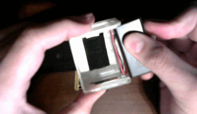
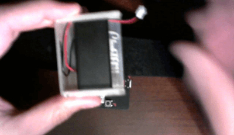
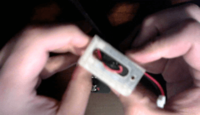
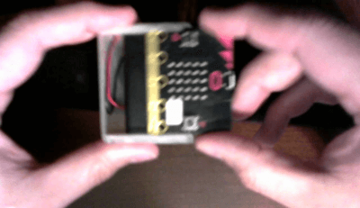
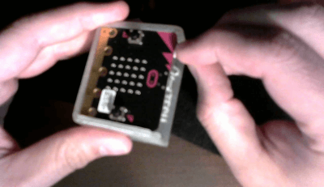

# Digital Watch Assembly
[Home](./)

1. Once you have tested your watch connected via USB to the computer, it is time to mount it into the watch frame. 
1. Lace the velcro strap through the slots on the back of the watch frame, this will make the watch band. 

    
    

1. If you wish to decorate your band, now is your chance, before we attach the electrical components. 
1. Mounting the battery pack

    > NOTE: The battery pack will fit **very** tightly in the frame, you need to be careful during this process that you do not damage the battery pack, the wires, or the frame. 

    1. Put the batteries in the battery pack, be sure to check the polarity with the drawing inside the battery pack, to ensure that you are putting the batteries in the right way.
    1. Hold the battery pack with the cover facing you and the wires at the top. Wrap the wires along the top and left side tightly. This will allow you to loop excess wire inside the watch frame, the wires should run up the inside of the frame next to the velcro strap. 

                

    1. Tip the top of the battery pack in first and slide it into the frame.

        

    1. When done it should look something like this.

        

    1. Note: the wires should not be pinched between the frame and the top of the battery pack.

        

    1. You can now slide the micro:bit into the frame.

        

    1. And then plug it in. 

        >NOTE: When you are not using your watch, disconnect the power to avoid draining the batteries.

        

## To update the software running on your micro:bit watch

1. Ensure the power from the batteries is disconnected. 
1. (Optionally) Slide the micro:bit out of the frame, leave the battery pack and band attached to the frame. 
1. Plug the miro:bit into your computer via USB
1. You will now be able to download new code to the micro:bit

> Note: perform these setps in revers to reassemble your watch.
