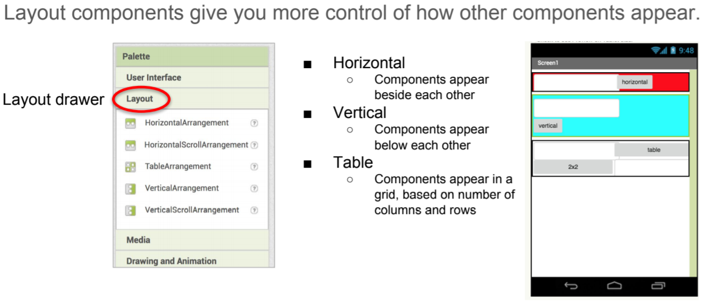
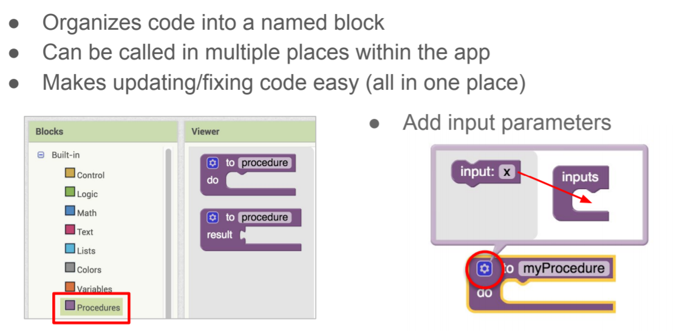

# My Piano

Do you play a musical instrument? In this lesson you will be creating a Piano App.

## Introduction to Layout Components 

When programming mobile apps we use Layout Components to make our apps more flexible as we want our apps to work well on devices from small cell phones to large tables. 

## Introduction to Procedures 

When programming apps we use procedures to help organize our code. Sometimes developers will call them methods, subroutines or functions. Procedures have many benefits:

## Build the app

1. Download the app template [here](./ctct/Unit02-MyPiano/MyPiano_template_MS.aia)
1. Part 1: Layout your Piano [here](./ctct/Unit02-MyPiano/StudentGuidePart1.pdf)
1. Part 2: Add sound to your Piano [here](./ctct/Unit02-MyPiano/StudentGuidePart2.pdf)
1. Part 3: Refactor your app to use procedures [here](./ctct/Unit02-MyPiano/StudentGuidePart3.pdf)
1. Challenge: Add sharp notes and recording to your app [here](./ctct/Unit02-MyPiano/StudentGuideChallenge.pdf)

[Home](./index.md)