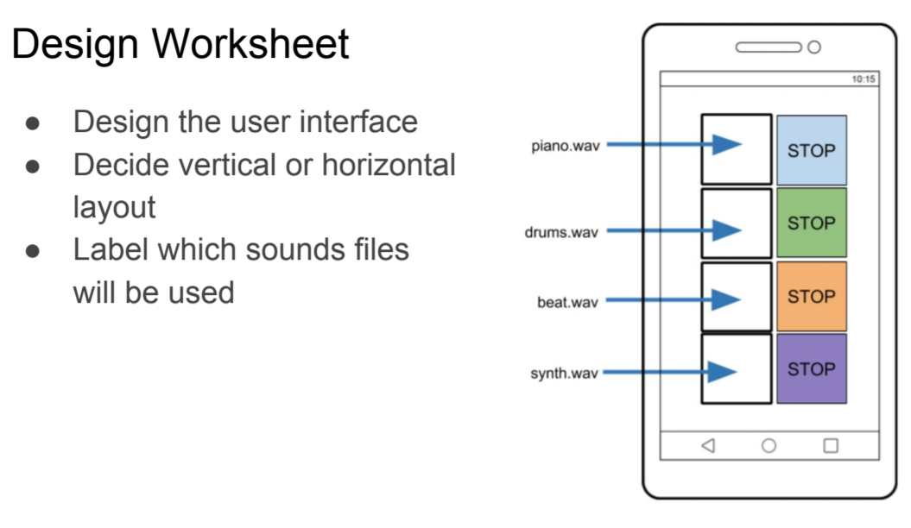

# Music Maker

- How can we improve our Piano App?
- How can we make a music app that can play sounds simultaneously?

## More Layout Components

## Player Component

## Design the app

Using the Design worksheet draw what your app will look like. 

Your app shall be able to play music from 4 instruments. You will need a button to start playing each instrument and another to stop playing each instrument (8 total). The start buttons will each have a picture representing the instrument. The stop buttons will be a red circle with the word "STOP" in it. 

## Build the app

1. Download the app template [here](./ctct/Unit03-MusicMaker/MusicMaker_template_MS.aia)
2. Part 1: Add the instruments [here](./ctct/Unit03-MusicMaker/StudentGuidePart1.pdf)
3. Part 2: Give the instruments sound [here](./ctct/Unit03-MusicMaker/StudentGuidePart2.pdf)
5. Challenge: Add recording to your app [here](./ctct/Unit03-MusicMaker/StudentGuideChallenge.pdf)

[Home](./index.md)