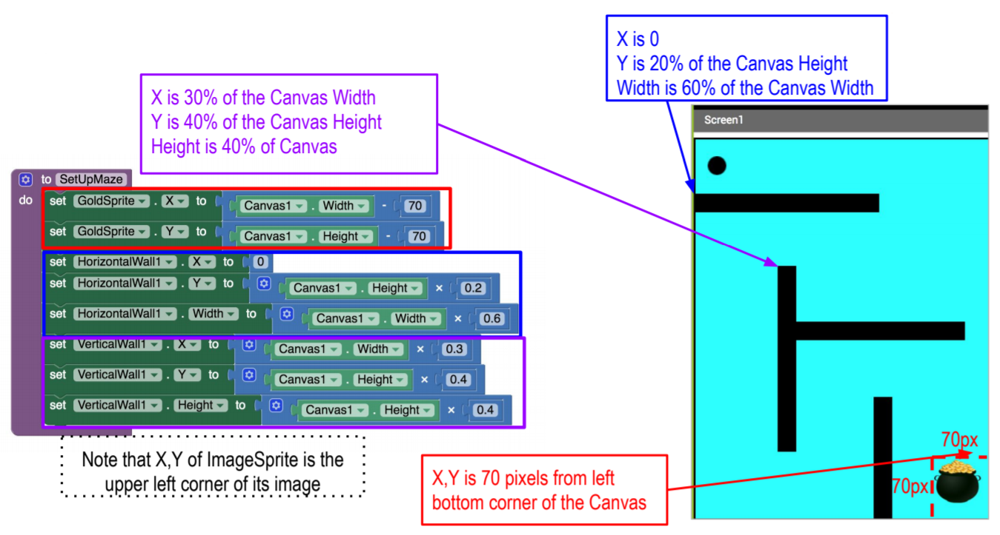

# Find the Gold

- How can you control sprites or characters in a mobile game app?
- What sensors can you use in a phone or tablet to control movement of sprites?

## Drawing and Animation Components

## X, Y Placement

## Screen Resolution

## X, Y Placement of Image Sprites

 - In the Designer, you can only specify X, Y by pixels
 - In the code you can calculate placment using Canvas.Width and Canvas.Height

## The Accelerometer

## Conditionals

- In our app we need to test **if** the ball collided with the GoldSprite.

- **If** blocks allow you to execute code blocks when a certain condition is true. 
- Logic and Math blocks are use to compare two items to test if they are true/false.

## Conditionals in App Inventor

## Notifier Component

## Build the app

1. Download the app template [here](./ctct/Unit04-FindTheGold/FindTheGold_MS_VTemplate.aia)
1. Part 1: Create the playing field [here](./ctct/Unit04-FindTheGold/StudentGuidePart1.pdf)
1. Part 2: Add ball movement [here](./ctct/Unit04-FindTheGold/StudentGuidePart2.pdf)
1. Part 3: Add collision detection [here](./ctct/Unit04-FindTheGold/StudentGuidePart3.pdf)
1. Challenge: Add scoring, lives, timer, sounds and levels [here](./ctct/Unit04-FindTheGold/StudentGuideChallenge.pdf)

### Misc Files
- [Yay](/ctct/Unit04-FindTheGold/yea.mp3)
- [Fail](/ctct/Unit04-FindTheGold/fail.mp3)

[Home](./index.md)