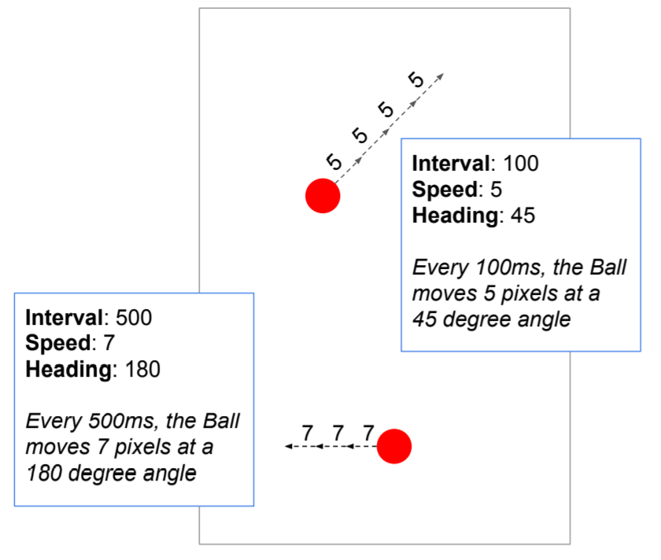
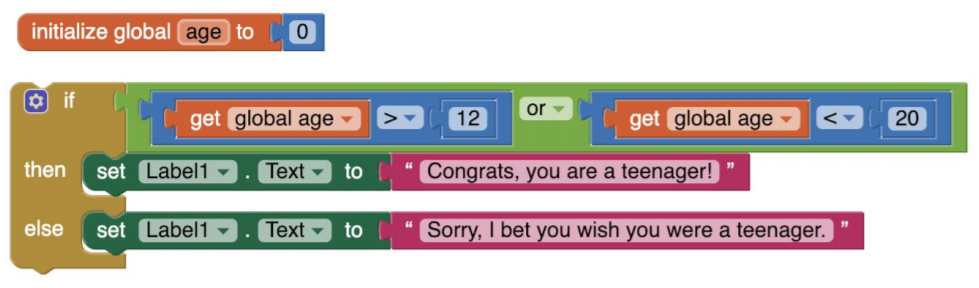
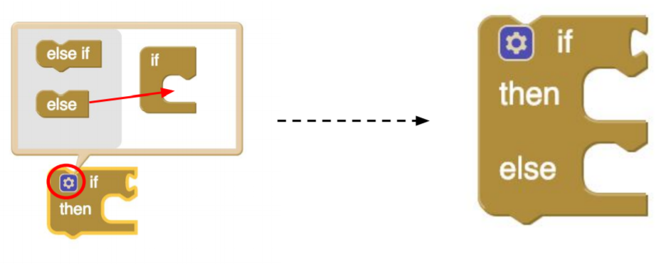
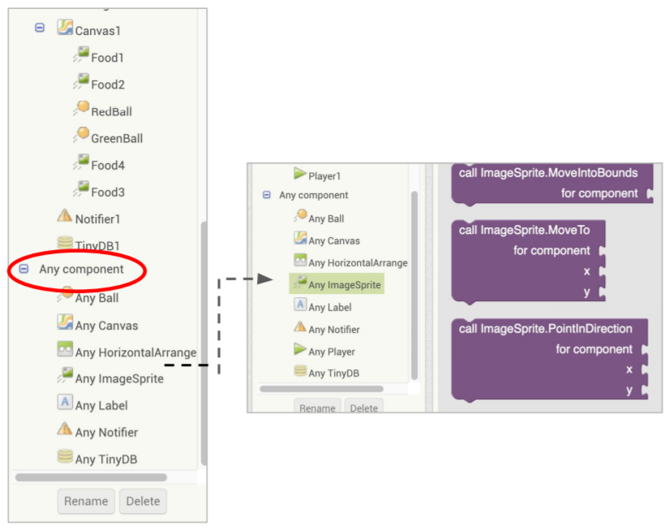
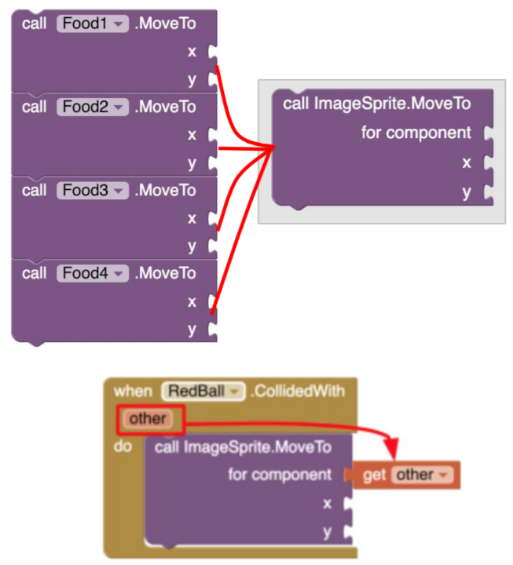
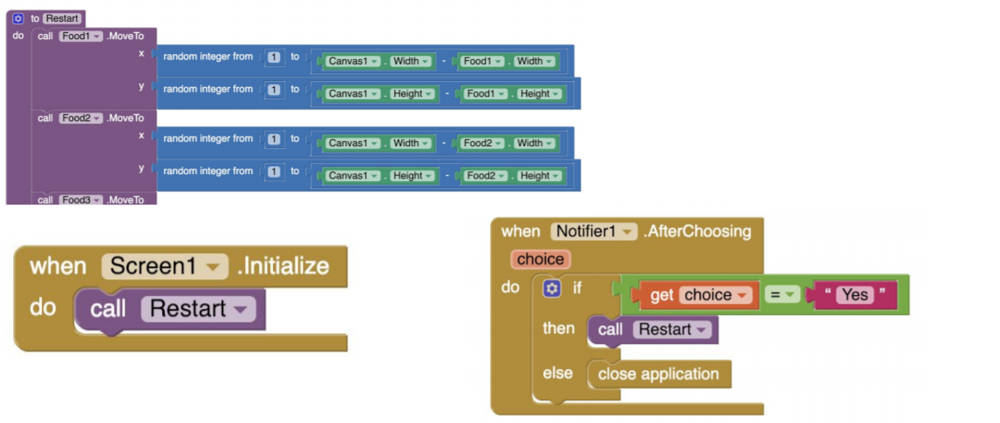
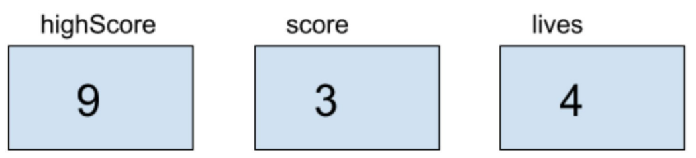
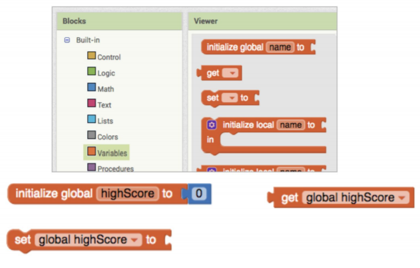
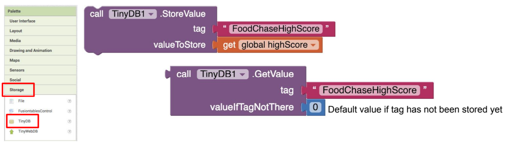

# Food Chase Game

In this exercise you will make a game app with two balls. The red ball eats food to grow, however it must avoid touching the green ball.

## Drawing Components
- Canvas is your background for sprites to appears and move.
- Balls/ImageSprites are the elements on the canvas that can be controlled by user interaction and by coding
- The screen is considered the “parent”, fill parent means fill the page.
- This app will use the Flung event for the Canvas and transfer the speed and heading of the fling to set the Ball’s movement.

## Animation

## if-then-else
- Do one thing if the condition is true
- Do another thing if it is false

## Any Component
- Each component in the app as a set of Any Component blocks

- You can use this block and apply it to any ImageSprite.
- Generalizes the movement of an ImageSprite (example of Abstraction)
- Allows you to condense your code to a single block (instead of 4)
- Use the other parameter to specify which ImageSprite in RedBall.CollidedWith.

## Procedures
- Separates out a particular "task" or action that may involve several code blocks
- If you have similar code blocks in multiple parts of your program, it is easier and better practice to have one set of code blocks, organized as a procedure.
- Helpful with testing and debugging. Once you have tested a procedure and confirmed that it works correctly, then it does not have to be tested again.
- Procedures make updating code easier. If a procedure’s blocks need to be changed to accommodate a new feature, it only has to be changed in one place. 

### Restart Procedure
- Sets positions of all the ImageSprites
- Sets radii of RedBall and GreenBall to 2
- Called when app starts and when user chooses to play again

## Variables
- Placeholders to store values in an app
- Can update the value
- Can get the value by variable name

- Initialize sets the variable to its starting value
- Set changes the value
- Get accesses the value

## TinyDB
- Variable values disappear when you close the app.
- If you want to store values persistently (between executions of the app), use the TinyDB component.
- Stores tags and their values on the mobile device. 
- StoreValue stores the value in TinyDB
- GetValue gets the value from TinyDB
- Tag is like the variable name
- Value is the value being stored (and gotten)

## Variables vs TinyDB

| | Variable | TinyDB |
|---|---|---|
| Persistence | Anything stored in a variable is erased when the app closes | Anything stored in TinyDB with a tag can be retrieved at any point, even after the app is closed and reopened |
| Storing data | set name to value | TinyDB.StoreValue (tag, value) |
| Retrieving stored data | get name | TinyDB.GetValue(tag, valueIfTagNotThere) |

## Build the app

1. Download the app template [here](./ctct/Unit05-FoodChaseGame/FoodChase_template.aia)
2. Part 1: Create the game [here](./ctct/Unit05-FoodChaseGame/StudentGuidePart1.pdf)
3. Part 2: Add collision detection [here](./ctct/Unit05-FoodChaseGame/StudentGuidePart2.pdf)
4. Part 3: Add app features [here](./ctct/Unit05-FoodChaseGame/StudentGuidePart3.pdf)
5. Part 4: Add high score [here](./ctct/Unit05-FoodChaseGame/StudentGuidePart4.pdf)
6. Challenge: Add moving food, sound, greenball speed,  [here](./ctct/Unit05-FoodChaseGame/StudentGuideChallenge.pdf)

[Home](./index.md)