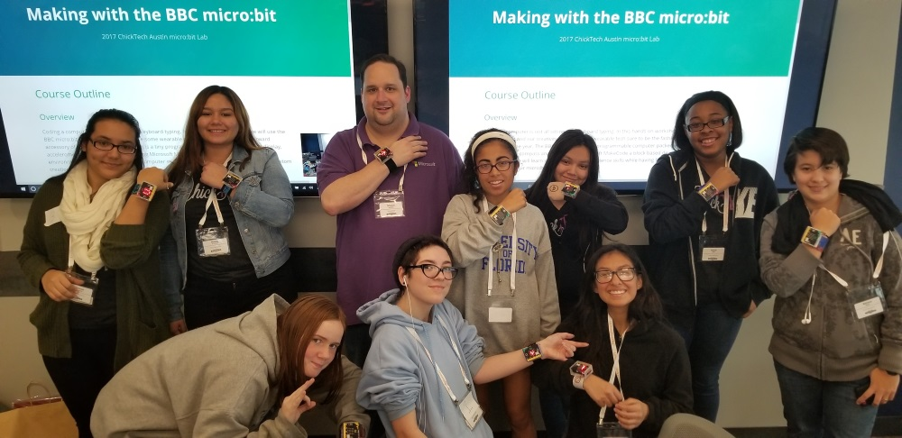

# Course Outline

## Overview 
Coding a computer is not all sitting at a keyboard typing. In this hands on workshop we will use the BBC micro:bit and our creativity to make some wearable tech sure to be the fashion forward accessory of the year. The BBC micro:bit is a tiny programmable computer packed with a display, accelerometer, compass and more. Using Microsoft MakeCode a block based development environment we will learn some basic computer science skills while having fun making some custom creations with our micro:bit computer.  

## Take Home Item
BBC micro:bit maker kit and custom creation, a multi-funciton micro:bit watch

## Day 1 - Saturday 12/8

1. **9:00 AM to 10:00 AM:** Welcome
1. **10:00 AM to Noon:** Intro & Algorithms
    1. [Warmup](./010201_Warmup.html)
    1. [micro:bit Hardware](./010202_HardwareOverview.html)
    1. [micro:bit Software](./010203_SoftwareOverview.html)
    1. [Happy Face, Sad Face](./010204_HappySadFace.html)
    1. [Fidget:bit Challenge](./010205_FidgetBit.html)
1. **Noon to 1:00 PM:** Lunch
1. **1:00 PM to 2:00 PM:** 3d Printing
    1. [Using our 3d printer to make a watch frame](./010401_3dprinting.html)
1. **2:00 PM to 3:00 PM:** Variables
    1. [Overview](./010501_Variables.html)
    1. [Counter](./010502_Counter.html)
    1. [Scorekeeper Challenge](./010503_Scorekeeper.html)
1. **3:00 PM to 4:00 PM:** Conditional statements
    1. [Overview](./010601_Conditionals.html)
    1. [Rock, paper, scissors](./010602_RockPaperScissors.html)
    1. [micro:bit iPod Challenge](./010603_iPod.html)
1. **4:00 PM to 4:45 PM:** Day 1 Standup

## Day 2 - Sunday 12/9
1. **9:00 AM to 10:00 PM:** Iteration, Looping & Coordinates
    1. [Overview](./020101_Iteration.html)
    1. [Traveling Light](./020102_TravelingLight.html)
    1. [Traveling Light Challenge](./020103_TravelingLight.html)
1. **10:00 AM to 11:00 PM:** Booleans
    1. [Overview](./020201_Booleans.html)
    1. [Pick a Hand Game](./020202_PickHand.html)
    1. [Pick a Hand Game Challenge](./020203_PickHand2.html)
1. **11:00 AM to Noon:** Arrays
    1. [Overview](./020301_Arrays.html)
    1. [Sorting Arrays](./020302_Sorting.html)
    1. [Magic 8 Ball](./020303_8Ball.html)
1. **Noon to 1:00 PM:** Lunch    
1. **1:00 PM to 3:00 PM:** Watch
    1. [Watch Assembly](./020402_Assembly.html)
    1. [Watch Software](./020401_Watch.html)
    1. [Pedometer Challenge](./020403_Pedometer.html)
    1. [Stop Watch Challenge](./020404_Stopwatch.html)
    1. [Compass Challenge](./020405_Compass.html)
1. **3:00 PM to 3:45 PM:** Day 2 Standup
1. **3:45 PM to 4:10 PM:** Tech Fair Setup

## Bonus
[micro:bit Binary Telegraph](./020405_Telegraph.html)

## More Projects Ideas:
1. [microbit.org](http://microbit.org/ideas/)
1. [TechWillSaveUs.com](https://make.techwillsaveus.com/bbc-microbit/bit)

## Reference:
1. [MakeCode Block Reference](https://makecode.microbit.org/reference)

## Credits
Ideas, activities have been borrowed from:
1. [microbit.org](http://microbit.org/ideas/)
1. [TechWillSaveUs.com](https://make.techwillsaveus.com/bbc-microbit/bit)
1. [code.org](https://code.org)